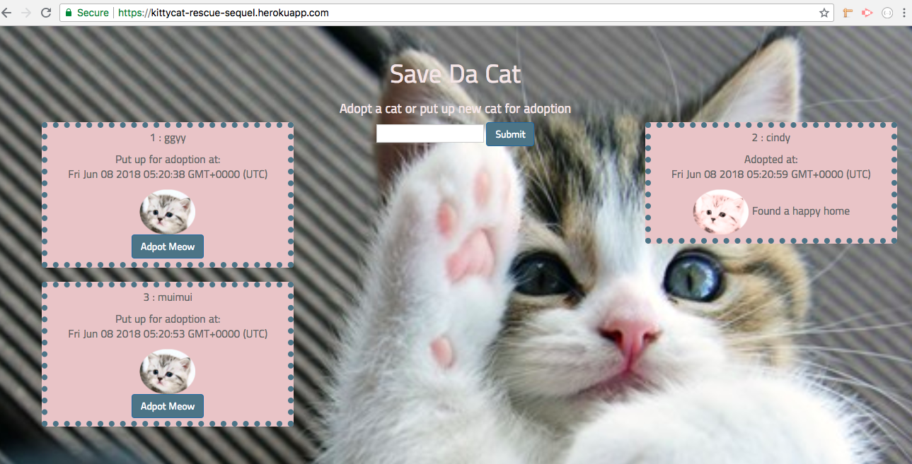

# CatRescueSequel
UC Berkeley coding assignment 13
The Sequel

### Overview

This homework assignment is **optional**.

In this assignment, you're going to Sequelize the `cat` app you made this week. We've split this exercise into three different tiers, all with different tasks and expectations. Finish whichever tier will provide you with the most reasonable challenge.


### Submission on BCS

* Please submit both the deployed Github.io link to your homework AND the link to the Github Repository!

#### Tier 1: Sequelized! (Basic to Moderate)

* Remove all references to your vanilla MySQL queries and replace them with Sequelize queries.

* That means:

  * Replacing your MySQL `cat` model with a Sequelized equivalent.

    * Don't forget to edit the model and initial migration file to make the cat's adpoted field carry a default value of false -- otherwise you might encounter bugs.
      * There's no option to include that default in the command line, so you'll need to open up your editor to make this change.
    * Don't forget to sync the models!

    * Edit your new `config.json` file to include your database configurations. Place your JawsDB details in the `production` property of your json file; the details of your local database go in the `developer` property.

    * Remove your old ORM file, as well as any references to it in `cats_controller.js`. Replace those references with Sequelize's ORM methods.

* When you finish, your site should function just like your last one:
    

#### Tier 2: Customer Associations (Challenge)

* Add in a Customer association to the project. This will involve creating at least one new Customer model and connecting it with your cat model.

* What kind of association you would like to use is up to you. Does a Customer have one cat? Many cats?

* For example, you could make a site that logs the name of which Customer adopt which cat, where each Customer only gets one cat. 

* If you do go select this tier, you must edit the handlebars files and CSS stylesheets to implement some sort of additional feature to the site. We don't want you to just connect two models and submit your project. Make your site do something relevant to this association.

#### Bonus! (Challenge)

* Add validations to your models where:

  * A cat's name cannot be null
  * A cat's rescued status is false by default
  * A Customer's name cannot be null

* Order the cats you send back to the user in alphabetical order using the Sequelize "order" option.


### Key learning points

* rename your heroko app deployment using this inside the project folder
```
heroku apps:rename kittycat-rescue-sequel
```
* heroku server error debug
```
heroku logs -t
```
* initial sequelize
```
(sudo)? npm install -g sequelize-cli sequelize
------
sequelize init:config
sequelize init:models
```

```javascript
// sequelize model creating quick reference
module.exports = function(sequelize, DataTypes) {
  var Cat = sequelize.define("Cat", {
    cat_name: {
      type: DataTypes.STRING,
      allowNull: false,
      validate: {
        len: [1-40]
      }
    },
    rescued: {
      type: DataTypes.BOOLEAN,
      defaultValue: false    }
  });
  return Cat;
}

```

```javascript
//client side ajax calls quick reference
$("#addCat").on("submit",function(event){
		event.preventDefault();
		var catName = $("[name=catname]").val().trim(); //grab value from form
		var newCatObj = {
			name:catName,
		}
		console.log(newCatObj);
		$.post("/addcat",newCatObj)
		.then(function(){
			location.reload();
		});
});

```

```javascript
//sequelize post method quick reference 
router.post("/addcat",function(req,res){
    console.log(req.body);
    db.Cat.create({cat_name:req.body.name}).then(function(data){
        res.json(data);
    });
})
```

```javascript
//sequelize get method quick reference 
 router.get("/", function(req, res) {
    console.log(db.Cat);
    db.Cat.findAll({})
    .then(function(data) {
      res.render("../views/index.handlebars",data);
    });
  });
```

```javascript
//sequelize put method quick reference 
router.put("/adpotcat/:id",function(req,res){
     console.log("inside adopt");
    db.Cat.update(
        {rescued:1},
        {where:{id:req.params.id}})
    .then(function(data){
        // console.log(data);
        res.json(data);
    });
})
```

```javascript
//heroku database set up quick reference
var connection;

if(process.env.JAWSDB_URL){
  connection = mysql.createConnection(process.env.JAWSDB_URL);
}
else{
  //local database setting goes here
  connection = mysql.createConnection({
    host: "localhost",
  ...
  })
}

```  

``` html
<!-- handlebar basic usuage quick reference-->
<div class = "col-md-4 col-sm-4">
  <ul>
	{{#each cats}}
	 {{#unless rescued}}
	   <div class ="alert alert-info ">
		<li>
            <p> {{id}} : {{cat_name}}</p>
            <p> Posted at:<br>{{updatedAt}}</p>
            
			<form id ="adpotCat"  method="POST">
			<button type="submit" class = "btn btn-primary adpBtn" data-id={{id}}>Adpot Meow</button>
			</form>
		</li>
	   </div>
	 {{/unless}}
	{{/each}}
  </ul>
</div>
```

## Link to the site
[https://kittycat-rescue-sequel.herokuapp.com/](https://kittycat-rescue-sequel.herokuapp.com/)

## Author 
[Kitty Shen ](https://github.com/kittyshen)

https://github.com/kittyshen

### [Link to Portfolio Site](https://kittyshen.github.io/Portfolio/)

## License
Standard MIT License
